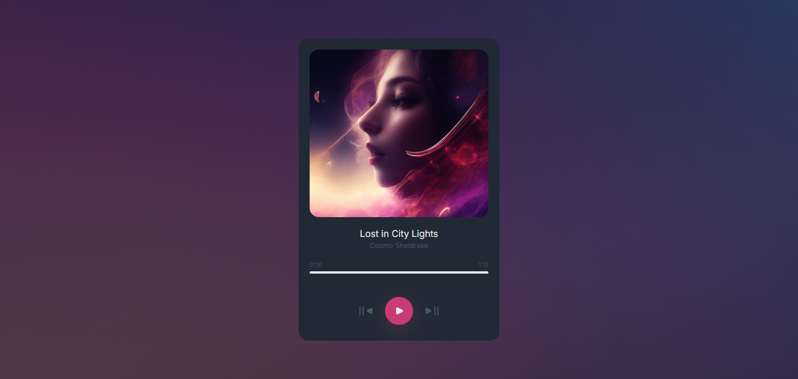

<!-- Please update value in the {}  -->

<h1 align="center">Music Player | devChallenges</h1>

<div align="center">
   Solution for a challenge <a href="https://devchallenges.io/challenge/music-player" target="_blank">Music Player
</a> from <a href="http://devchallenges.io" target="_blank">devChallenges.io</a>.
</div>

<div align="center">
  <h3>
    <a href="https://gustavo2023.github.io/music-player/">
      Demo
    </a>
    <span> | </span>
    <a href="https://devchallenges.io/solution/46774">
      Solution
    </a>
    <span> | </span>
    <a href="https://devchallenges.io/challenge/music-player">
      Challenge
    </a>
  </h3>
</div>

<!-- TABLE OF CONTENTS -->

## Table of Contents

- [Overview](#overview)
  - [What I learned](#what-i-learned)
- [Built with](#built-with)
- [Features](#features)

<!-- OVERVIEW -->

## Overview



This music player allows a user to listen to different songs and control the palying experience. They can move to the next or previous song, as well as playing any part of the currently playing song.

### What I learned

- **Objects and Arrays:** By using an array of objects I can store multiple songs and their properties like title, artist, image, etc. This makes it easy to manage and switch between songs.

By using an Audio instance with the source of the songs the user can play, pause and set the playback time. Different event listeners like ```loadedmetadata``` and ```timeupdate``` are useful to obtain the data of the audio and use it to update the UI.

### Built with

- Semantic HTML5 markup
- CSS custom properties
- Flexbox

## Features

- **Play and Pause functionality**
- **Skip song or go to the previous one**
- **Move to any part of the song**

This application/site was created as a submission to a [DevChallenges](https://devchallenges.io/challenges-dashboard) challenge.

## Author

- GitHub [@gustavo2023](https://github.com/gustavo2023)
